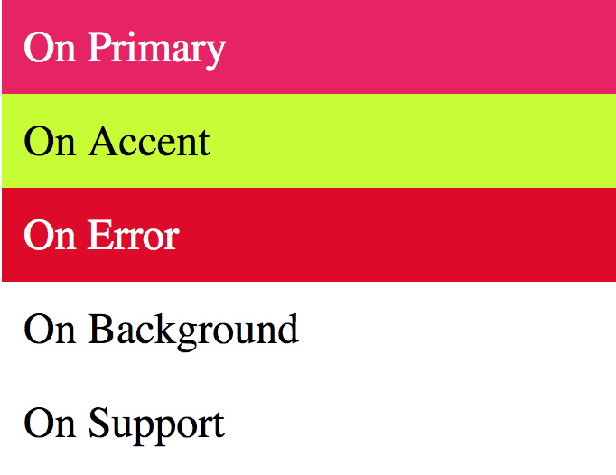

# Web Developper logbook
## Past - What happened until now

What I haven't recorded in the past:
 - multiple attemtps to learn to code
 - source used so far:
 	- Project Odin
 	- CodeAcademy
 	- Code wars
 	- Udemy : Web Development Zero to Mastery from Andrei Neagoie at https://www.udemy.com/the-complete-web-developer-zero-to-mastery/
 	Course done from May 2018 to September 2018. Need a refresher but learned a lot.

## Why I start this log
I start this log after reading an article from Medium.
My past attempts have all 'failed', but I have learned a lot.
I still feel like I am trying to learn to swim in the middle of the ocean, and I feel the more I know, the less I know.
This log is an attempt to 'fix' what I learn, develop a clearer roadmap for learning, documenting my journey, celebrating little achievements and helping to keep my motivation up.
Also, as a 'side-effect', to help me improve my english and writing skills.

## Goal: why code?
As a plan B for body wearing work.
Always enjoyed coding, thought I might enjoy it as a work.

Location free job.
Little set up costs.
Future proof job.
Opportunity for remote work and part time, with appealing salaries.

## Why did I failed in the past?
Hard, very complex, lost.
Questionned why I was learning.
No programming buddies?
Lack of time?

# Skills tracker

Skills | Notions | Basics | Good | Very Good | Confident | Gun |
-------|---------|--------|------|-----------|-----------|-----|
Markdown |:v:|:v:|||||
HTML5 |:v:|:v:|||||
CSS |:v:|:v:|||||
Javascript |:v:|:v:|||||
Sass |:v:||||||
Node.js |:v:||||||
Project Architecture |:v:||||||
Design: colors |:v:||||||
Template |||||||

# RESSOURCES

### Design

##### Color

[Color system according to Material UI](https://material.io/design/color/#color-theme-creation)

# Logbook

## 25 February 2018
##### HTML, SASS, TERMINAL, MARKUP, API, JAVASCRIPT, NODE, GIT

* Tried to develop a mini program to feed expenses from a CSV in Splitwise. Project abandonned. Practiced JS, reading API documentation, terminal (how to print out a function).
	* Run script in the terminal using Node
	* Arrow function
	* Printing out function body using Function.toString()

* Review a couple of videos about node.JS from Udemy (Andre's course) (and express, briefly)

* Starting this documentation about my journey to become a Web dev, inspired from https://medium.freecodecamp.org/the-tools-and-resources-that-landed-me-a-front-end-developer-job-1314c6f1fa7f

* Used GIT on the current work today (init, status, add, commit).

* Started responsive project #3 (Landing page) on FCC. Attempted to use SASS (failed :))

* Topped up my motivation to become a web developper.

* Learnt a lot more about marked up language here: https://guides.github.com/features/mastering-markdown/

* Read a chapter about asynchronous programming in Eloquent Javascript. Haven't grasped all the concepts!

## 26 February 2018
##### SASS,GIT

* Set up Sass --watch for Sass on the FCC Responsive Project #3

* Build up a simple architecture for the project

* Learnt about colors trough material-UI and smashing magazine:
	* One primary color
	* One accent color
	* One background color (components)
	* One surface background (behind scrollable content)
	* Error color
	* 'ONs' color (on Primary, on Accent, etc)
	* Then you can use different shade of the primary/secondary color (hue) as required to separate section (example: App bar vs PhoneSystem bar)

	

* Read Eloquent Javascript on DOM
* Switched to Atom.io => love it!
  * Installed packages, struggle with keybindings conflicts.
  * This is a test line to try Git-plus :smile:
